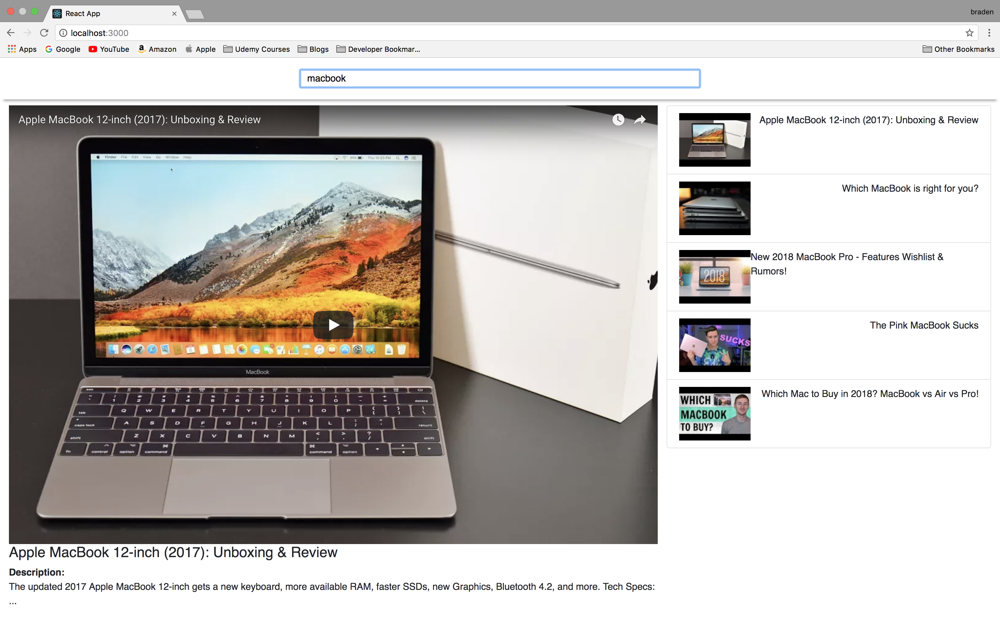

# Youtube Search Tool Project with react

* learned about setting the state in class based components.
* using data in different component with this.props.
* using callbacks as communication between parent and child components.

## Screenshots

